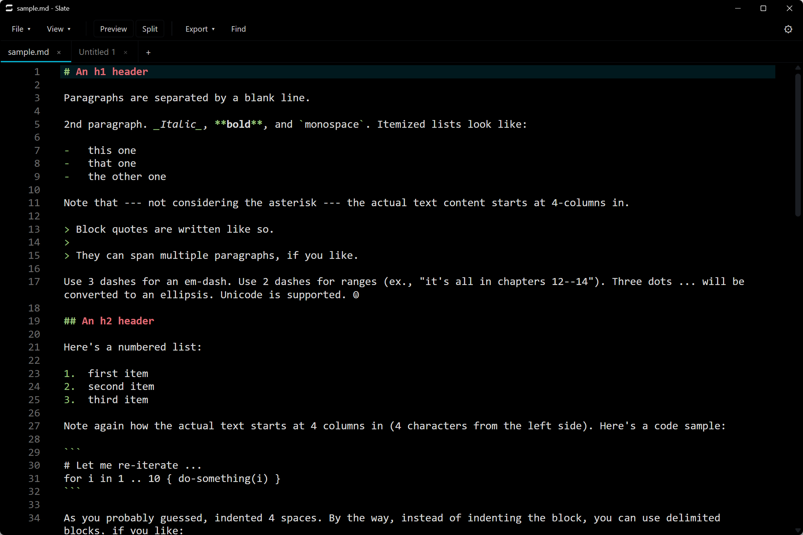

# Slate

A fast, local-first Windows markdown editor built with **Tauri 2**, **Svelte 5**, **CodeMirror 6**, and **Rust**.



## Features

- **Multi-tab editing** with drag-to-reorder, middle-click close, and a right-click context menu (Pin / Close / Close others / Close all). Pinned tabs cluster to the left with a configurable color strip.
- **Live Markdown preview** — GFM via marked, sanitized with DOMPurify, code highlighting via highlight.js. Three view modes: **Editor**, **Preview**, and **Split** (side-by-side with optional synced scroll).
- **Theme system**: Light · Dark · OLED (pure-black) · System (follows OS preference). Configurable **accent color** with 12 presets and a custom hex picker. **Menu text brightness** slider for dark themes (also drives the OS title-bar text color on Win11 22H2+).
- **CodeMirror 6 editor** with Markdown syntax highlighting, search & replace, line numbers, line wrapping (toggleable in toolbar), per-tab undo history, configurable font / size / line height. Zoom via Ctrl+wheel, Ctrl+= / Ctrl+- / Ctrl+0.
- **Markdown table auto-format** — pipe-table alignment on save (toggleable).
- **Smart paste** (Ctrl+Shift+V) — converts clipboard HTML to Markdown via Turndown (GFM tables, task lists, strikethrough).
- **Search panel** — draggable floating dialog with real-time accent highlighting in the editor, Next/Previous navigation, scope toggle (current tab / all open tabs / folder), Replace All with confirmation, optional multiline mode, regex, and whole-word matching.
- **Status bar** — file path, word / character count, estimated reading time, cursor line:column.
- **Export** to self-contained HTML (inlined stylesheets, no CDN) or PDF via the system print dialog.
- **Resilient** — autosaves drafts every 5 seconds to %APPDATA%\com.slate.app\drafts\; on relaunch you are offered to restore unsaved tabs. Detects external file changes and offers to reload.
- **Multiple windows** — File → New window (or Ctrl+Shift+N).
- **Fullscreen mode** — F11 toggles, chrome hides for distraction-free writing.
- **File associations** with .md, .markdown, .mdx, .txt, .log. "Open with" integration via Windows registry (single-instance; opening a second file reuses the running window).
- **Non-markdown files** — open .txt, .json, .js, etc. in the editor. Preview / Split buttons are disabled for non-markdown files.
- **Drag-and-drop file open**, recent files menu, settings persistence, cross-restart session restore.
- **Recent files** — remembers the last 10 opened files with a clear option.
- **Pinned tabs** — mark tabs as pinned; they cluster to the left with a color strip. Unpinned tabs cannot reorder past them.
- **External file change detection** — watches files on disk and alerts when a file has been modified externally.
- **Window title sync** — the window title reflects the active tab name and dirty state.
- **Toast notifications** — non-intrusive in-app notifications for errors, file changes, and info messages.
- **Win11 title-bar text-color sync** — matches the OS title-bar text color to the current theme/accent brightness.
- **Configurable editor text color** — automatically adjusts between light and dark shades based on the active theme.
- **Full session restore** — reopens all tabs from the previous session on launch.


## Installation

Download the latest installer from the [Releases page](https://github.com/MiaAI-Lab/Slate/releases):

[](https://github.com/MiaAI-Lab/Slate/releases/download/v1.0.21/Slate_1.0.21_x64_en-US.msi)
[](https://github.com/MiaAI-Lab/Slate/releases/download/v1.0.21/Slate_1.0.21_x64-setup.exe)

- **MSI** — Windows Installer package. Supports silent/unattended installation via msiexec. Recommended for enterprise deployment.
- **Setup EXE** — NSIS-based installer with a graphical setup wizard. Recommended for most users.

Both installers register Slate in the "Open with" menu for Markdown and plain-text files.

<a href='https://ko-fi.com/Z8Z3SPLOD' target='_blank'></a>
## Development Setup

### Prerequisites

- [Node.js](https://nodejs.org/) >= 18
- [pnpm](https://pnpm.io/) (
pm install -g pnpm)
- [Rust](https://rustup.rs/) stable toolchain (install via 
ustup)
- [WebView2](https://developer.microsoft.com/en-us/microsoft-edge/webview2/) (included with Windows 10/11; install the Evergreen Runtime if missing)
- [Visual Studio Build Tools](https://visualstudio.microsoft.com/visual-cpp-build-tools/) with the "Desktop development with C++" workload

### Get started

`powershell
# Clone the repository
git clone https://github.com/MiaAI-Lab/Slate.git
cd slate

# Install frontend dependencies
pnpm install

# Run in development mode (hot-reload)
pnpm tauri dev
`

The first build takes a few minutes while Cargo compiles Rust dependencies. Subsequent launches are fast.

### Build production installers

`powershell
pnpm tauri build
`

Or use the included build script:

`powershell
.\build.ps1               # Build with the current version
.\build.ps1 -Bump patch    # Bump patch, then build
.\build.ps1 -Bump minor    # Bump minor, then build
.\build.ps1 -Bump major    # Bump major, then build
.\build.ps1 -Version 2.0.0 # Set an explicit version, then build
.\build.ps1 -NoOpen        # Build without opening the output folder
`

Output installers are written to:
- src-tauri/target/release/bundle/msi/Slate_{version}_x64_en-US.msi
- src-tauri/target/release/bundle/nsis/Slate_{version}_x64-setup.exe

A double-click-friendly wrapper is also available: .\build.cmd (passes arguments through to uild.ps1).

### Type-checking

`powershell
pnpm check
`

## Keyboard Shortcuts

### Files / Tabs

| Shortcut | Action |
|---|---|
| Ctrl+N / Ctrl+T | New tab |
| Ctrl+Shift+N | New window |
| Ctrl+O | Open file... |
| Ctrl+S | Save |
| Ctrl+Shift+S | Save As... |
| Ctrl+W | Close active tab |
| Ctrl+Tab / Ctrl+Shift+Tab | Cycle through tabs |
| Ctrl+1 ... Ctrl+9 | Jump to tab 1–9 |
| Ctrl+P | Print (or Save as PDF) |

### Search

| Shortcut | Action |
|---|---|
| Ctrl+F | Toggle Search panel |
| Ctrl+H | Open Search panel (find + replace) |
| F3 / Enter | Next match |
| Shift+F3 | Previous match |
| Esc | Close Search panel |

### View / Settings

| Shortcut | Action |
|---|---|
| F11 | Toggle fullscreen |
| Ctrl+= / Ctrl++ | Increase editor & preview font |
| Ctrl+- | Decrease editor & preview font |
| Ctrl+0 | Reset font sizes to defaults |
| Ctrl+, | Open Settings dialog |

### Editor (Markdown formatting)

| Shortcut | Action |
|---|---|
| Ctrl+B | Wrap selection in **bold** |
| Ctrl+I | Wrap selection in _italic_ |
| ` Ctrl+ ` | Wrap selection in ` code ` |
| Ctrl+K | Insert [text](url) link |
| Ctrl+Shift+V | Paste clipboard HTML as Markdown |

## Project Layout

```
slate/
+-- src/                          Svelte 5 frontend
|   +-- App.svelte                Root layout + global keyboard handler
|   +-- main.ts                   Bootstrap (settings, session, mount)
|   +-- types.ts                  TypeScript type definitions
|   +-- app.css                   Global styles + Tailwind
|   +-- lib/
|       +-- components/           Toolbar, TabBar, StatusBar, Editor,
|       |                         Preview, dialogs, Toaster
|       +-- editor/               CodeMirror factory, compartments,
|       |                         keymaps, search highlight, table format
|       +-- state/                Stores (tabs, settings, search,
|       |                         confirm, toast, session, cursor, etc.)
|       +-- renderer/             Markdown to sanitized HTML
|       +-- utils/                fileService, exportService, exportHtml,
|                                 smartPaste, logging
+-- src-tauri/                    Rust backend (Tauri 2)
|   +-- src/
|   |   +-- commands/             Tauri commands (files, search, export,
|   |   |                         session, titlebar)
|   |   +-- lib.rs                Plugin registration, command handlers
|   |   +-- main.rs               Entry point
|   |   +-- watcher.rs            File change watcher
|   |   +-- open_with.rs          Windows Open with registration
|   |   +-- dialog_helper.rs      Native file open dialog
|   +-- tauri.conf.json           App config (window, bundle, plugins)
|   +-- capabilities/             Permission scopes
|   +-- icons/                    App icons (all sizes)
|   +-- Cargo.toml                Rust dependencies
|   +-- build.rs                  Tauri build script
+-- docs/                         Design docs and code review reports
+-- build.ps1                     Build script (version bump + build)
+-- build.cmd                     Double-click wrapper for build.ps1
+-- package.json                  Node dependencies and scripts
+-- pnpm-lock.yaml                Lockfile
+-- vite.config.ts                Vite configuration
+-- svelte.config.js              Svelte configuration
```
## Data Locations

| Data | Path |
|---|---|
| Settings | %APPDATA%\com.slate.app\settings.json (theme, accent, fonts, recents, etc.) |
| Drafts | %APPDATA%\com.slate.app\drafts\{tabId}.json (autosaved every 5s for dirty tabs) |
| Logs | %APPDATA%\com.slate.app\logs\md-editor.log (via 	auri-plugin-log) |

## Troubleshooting

### "WebView2 not found"
Download and install the [WebView2 Evergreen Runtime](https://developer.microsoft.com/en-us/microsoft-edge/webview2/).

### Rust build errors
- Ensure you have the x86_64-pc-windows-msvc Rust target installed: 
ustup target add x86_64-pc-windows-msvc
- Make sure Visual Studio Build Tools with "Desktop development with C++" is installed.
- Run cargo clean in src-tauri\ if you encounter incremental compilation issues.

### pnpm tauri build fails with Windows SDK errors
Install the latest Windows SDK via Visual Studio Installer. Tauri 2 requires the Windows 10 SDK (10.0.17763.0 or later).

### pnpm install fails on esbuild
The pnpm.onlyBuiltDependencies configuration in package.json allows esbuild to install native binaries. If you removed it, restore it or run:
`powershell
pnpm config set onlyBuiltDependencies '[]'
`

## Security & Privacy

Slate is a **local-first** editor. It does **not** communicate with any cloud service, send telemetry, or collect usage data.

- All files are read from and written to your local filesystem.
- Settings and drafts are stored locally in %APPDATA%\com.slate.app\.
- No network requests are made by the application itself.
- The Markdown preview uses DOMPurify to sanitize rendered HTML, and export-HTML inlines all assets (no CDN dependencies).

See [SECURITY.md](SECURITY.md) for the security policy.

## Contributing

See [CONTRIBUTING.md](CONTRIBUTING.md) for development setup, code style, and pull request guidelines.

## License

MIT — see [LICENSE](LICENSE).

---

*Built with [Tauri 2](https://v2.tauri.app/), [Svelte 5](https://svelte.dev/), [CodeMirror 6](https://codemirror.net/), and [Rust](https://www.rust-lang.org/).*